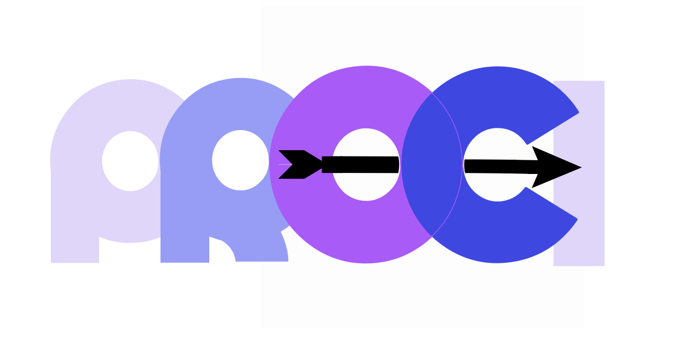

=======

# PROCI Workflow
This repository provides a systematic workflow for extracting, processing, and analyzing peer review data from Crossref to create a novel citation index compliant with the OpenCitations Data Model. The workflow combines advanced data extraction techniques, semantic modeling, and visual analytics to explore citation dynamics and peer review coverage.

## Repository Structure:
The repository is organized to streamline each phase of the workflow, from data extraction to analysis:

```
2023-2024-HARKONNEN-CODE/
│
├── data/
│   ├── raw/                    # Raw input data
│   │   └── lookup.csv          # Lookup tables and reference files
│   │    
│   ├── processed/              # Intermediate and processed data
│   │   ├── analysis            # Analytical results
│   │   ├── compartimentized    # Data split into compartments
│   │   ├── filtered            # Filtered data
│   │   ├── non peer            # Non-peer-reviewed data
│   │   └── peer                # Peer-reviewed data
│   │  
│   └── results/                # Final outputs
│
├── img/                        # Images used in documentation
│
├── scripts/                    # Workflow scripts
│   ├── extraction/             # Scripts for data extraction
│   │   ├── PeerExtractor.py
│   │   └── NonPeerExtractor.py
│   ├── processing/             # Data processing scripts
│   │   ├── FilterJoinDeltaDir.py
│   │   └── Compartimentizer.py
│   ├── post_processing/        # Post-processing and RDF creation
│   │   └── RDFcreator.py
│   ├── analysis/               # Analytical tools
│   │   ├── VenueCounter.py
│   │   └── MetaAnalysis.py
│   ├── data_visualization/     # Jupyter Notebook for visualizations
│   │   └── PROCI-data-visualization.ipynb
│   └── run.py                  # Main script for running tasks
│
├── requirements.txt            # Python dependencies
├── README.md                   # Project documentation
└── LICENSE.md                  # License information

```
Each directory and script serves a specific purpose, ensuring a clear separation of tasks for easy replication and customization.
---

## Abstract

This workflow is designed to address key research questions related to citation dynamics and peer review coverage in scholarly metadata. The pipeline is divided into four main phases, which build on one another to achieve a comprehensive analysis:

- **Data Gathering**: Extracting structured data from large-scale repositories like Crossref and OpenCitations Meta.
- **Data Processing**: Cleaning, filtering, and organizing the data for analysis.
- **Post-Processing**: Transforming data into RDF for semantic modeling.
- **Data Analysis and Visualization**: Generating insights into citation trends and dynamics through statistical and visual methods.

The ultimate goal is to enhance scholarly metadata by creating a citation index that connects peer reviews (citing entities) to publications (cited entities), thereby improving transparency and research reproducibility.

---

## How to Use
    This section provides a step-by-step guide to replicate the workflow:

### Setup and Installation

1. **Requirements**: 
    - Python 3.10 or later.
    - Disk space: at least 200GB free
    - RAM: 16GB recommended for processing large datasets; 8GB is sufficient but may result in slower performance and potential issues.

2. **Clone the Repository**:
   ```bash
   git clone https://github.com/open-sci/2023-2024-harkonnen-code/tree/main
   cd 2023-2024-harkonnen-code/

3. **Install Dependencies**:
   ```bash
   pip install -r requirements.txt
    
4. **Prepare Data: Download the datasets**:

    - **[Crossref Dump](https://academictorrents.com/details/d9e554f4f0c3047d9f49e448a7004f7aa1701b69)**: 185GB (April 2023). Contains academic metadata (DOIs, titles, authors, dates, peer review details).  
        - Note: The dataset used for this workflow was provided in 18 smaller chunks rather than a single large file. While using a single file should not cause any issues, we disclose this detail for transparency and reproducibility purposes.  

    - **[OpenCitations Meta Dump](https://opencitations.net/download#meta)**: 11GB (April 2024). Contains citation networks with citing and cited DOIs.  
    
---

### Workflow Execution
    The workflow is divided into distinct phases, each with a specific goal:

1. **Data Gathering**:

Data Gathering: Extract peer-reviewed and non-peer-reviewed data from the Crossref dump:

Peer Reviews:

    python run.py PeerExtractor <path_to_zip> <output_csv>

Non-Peer Reviews:

    python run.py NonPeerExtractor <path_to_zip> <output_csv>

2. **Data Processing**:

Data Processing: Combine peer-reviewed and non-peer-reviewed data, calculate temporal deltas, and filter results:

    python run.py FilterJoinDeltaDir \
    --filter_peer_review_dir <peer_dir> \
    --filter_non_peer_review_dir <non_peer_dir> \
    --filter_output_path <output_csv>
    
3. **Post-Processing**:

Post-Processing: Split Data into Separate CSVs to organize the processed data and convert it to RDF for semantic modeling:

    python run.py Compartimentizer <input_csv>
    
Generate RDF:

    python run.py RDF \
    --rdf_input <input_csv> \
    --rdf_output <output_file> \
    --rdf_baseurl <base_url> \
    --rdf_populate_data
    
4. **Data Analysis and Visualization**:

Data Analysis and Visualization: Use analytical tools to explore trends and visualize the results:

Analyze Top Venues:

    python run.py Venue <input_csv> --venue_output_file <output_csv>

Cross-Reference Data with OpenCitations Meta:

    python run.py Meta <combined_csv> <meta_zip_file> --meta_mode all --meta_output_file <output_csv>

**Research Questions**:

- What percentage of Crossref peer reviews are in OpenCitations Meta?
- Which venues receive the most peer reviews?
- How many citations involve resources in both Crossref and Meta?
- What are the time dynamics of peer-reviewed citations?

## Results:

**Outputs**:

- CSV Files:
  - Citations
  - Provenance
  - Venues
- RDF:
  - Serialized triples in N-Triples format

**Visualizations**:
- Bar charts, donut charts, and line graphs for citation statistics and dynamics.
